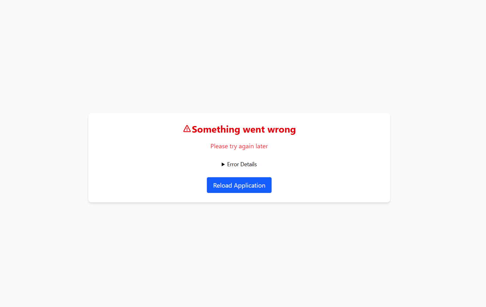

# GitHub Trending Repositories Explorer

A responsive web application that displays the most starred GitHub repositories created in the last 10 days, with infinite scroll pagination.

## Features

-  Displays trending GitHub repos (most starred in last 10 days)
-  Fully responsive design
-  Infinite scroll pagination
-  Repository details including:
   - Repository name with link
   - Description
   - Star count
   - Owner avatar and username
-  Error boundary for graceful error handling

## Screenshot
Sample App Layout


Error Layout


## How It Works

The app fetches data from GitHub's search API endpoint using the URL
```https://api.github.com/search/repositories?q=created:%3E2025-08-05&sort=stars&order=desc&page=```

Current date is considered as one day before the present date since the api respond with empty array for the present date.